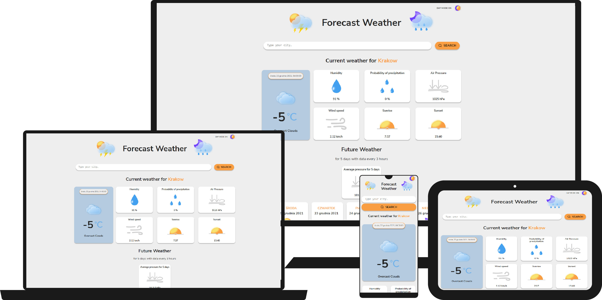

# Forecast Weather 

## Preview of the website 
# 
=> [Click here](https://izabelanowak.github.io/forecast-weather/) to see my website demo!
## External source
Api from [OpenWeather](https://openweathermap.org/forecast5)

Icons from [Figma community](https://www.figma.com/community/file/972934576657989859)

## Description
There is a simple application that shows a 5-day forecast weather for a city by name. It shows the current weather and forecast for the following days every three hours.

User enters the name of the city in the search field, and then weather data is downloaded from an external api. 
Next weather information (temperature, weather icon, short weather description, humidity, pressure, precipitation probability, sunrise and sunset) is displayed on the screen.
As a bonus, the average pressure for 5 days is calculated.
Tiles with weather information for 5 days are generated below. There user can find information about the weather date, an icon, minimum and maximum temperature and the Show more button that takes the user to the hourly weather list of the selected day (data every 3 hours).
At the top of the page, user can change the mode to day or night (the selected mode is saved in LocalStorage).


## How to use
See gif below to see how Forecast Weather works!


## Used technologies: 
- Semantic HTML
- CSS, grid, flexbox
- ES6+ features
- React, create-react-app, 
- react-hooks: useEffect, useRef, useSelector, useDispatch
- custom Hook: useWeatherDay
- Webpack
- Babel
- Redux, redux-toolkit, redux-saga
- Styled Components (ThemeProvider)
- Axios
- theme light and dark
- localStorage
- responsively adapted application

## Files structure:
```markdown
├───common
│   └───ThemeSwitcher
├───core
│   └───App
└───features
    └───forecastWeather
        └───ForecastWeather
            ├───CityWeather
            ├───DataTile
            │   └───icons
            ├───Error
            ├───FutureWeather
            │   └───DayTile
            ├───Header
            │   └───icons
            ├───Loading
            ├───MainContainer
            ├───Search
            ├───StatusChecker
            └───WeatherTile
                ├───icons
                └───ShowMoreButton
```
# Getting Started with Create React App

This project was bootstrapped with [Create React App](https://github.com/facebook/create-react-app).

## Available Scripts

In the project directory, you can run:

### `npm start`

Runs the app in the development mode.\
Open [http://localhost:3000](http://localhost:3000) to view it in the browser.

The page will reload if you make edits.\
You will also see any lint errors in the console.

### `npm run build`

Builds the app for production to the `build` folder.\
It correctly bundles React in production mode and optimizes the build for the best performance.

The build is minified and the filenames include the hashes.
Your app is ready to be deployed!

See the section about [deployment](https://facebook.github.io/create-react-app/docs/deployment) for more information.